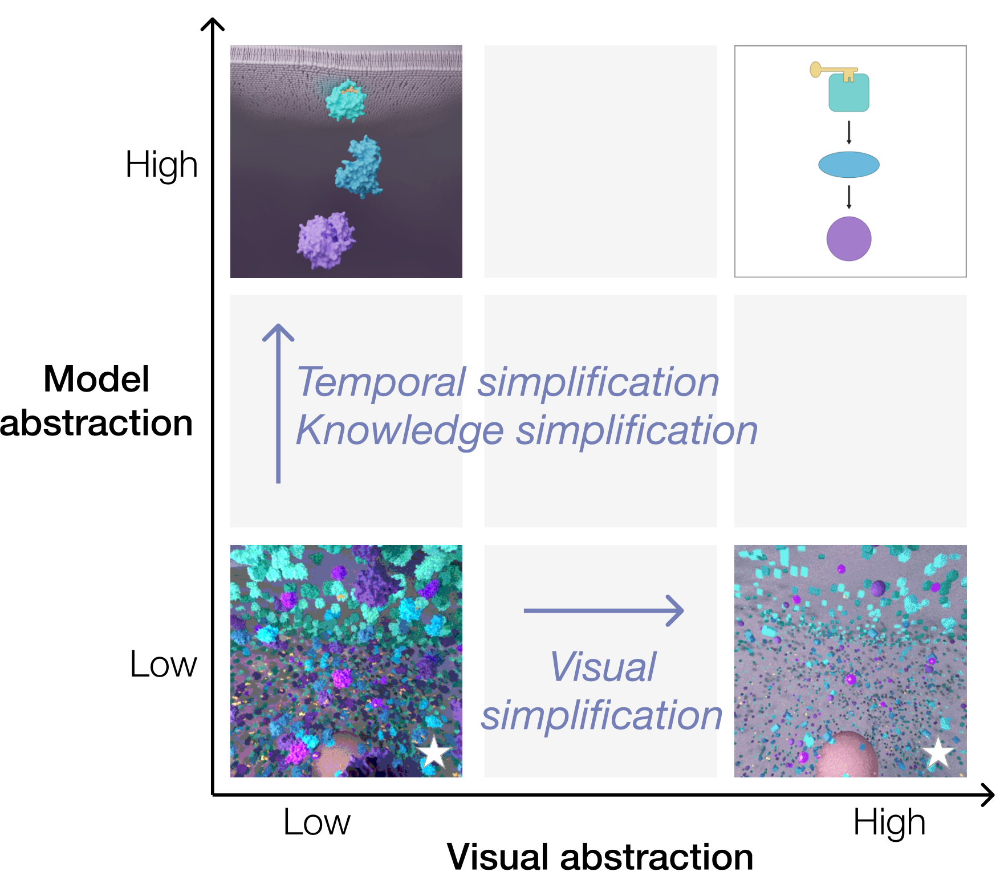

# An Exploration of Practice and Preferences for the Visual Communication of Biomedical Processes
_Supplementary material for [2021 VCBM Conference](https://conferences.eg.org/vcbm2021/) paper_

L.A. Garrison, M. Meuschke, J. Fairman, N. Smit, B. Preim, and S. Bruckner, "An Exploration of Practice and Preferences for the Visual Communication of Biomedical Processes," in Proceedings of VCBM, 2021.

Read [our full paper here!](https://vis.uib.no/wp-content/papercite-data/pdfs/Garrison-2021-EPP.pdf)

In this repository we include a number of supplementary materials that accompany our [VCBM conference paper](https://vis.uib.no/wp-content/papercite-data/pdfs/Garrison-2021-EPP.pdf) to provide additional information for anyone interested. We've organized these materials as follows:
1. [Supplementary material details](1-survey_supplementary_details.pdf). 
This document serves as a primary supplement
to our work. Here we provide interested readers a deeper layer of topic-specific details on (1)
asset scores, (2) attribute rankings, and (3) keywords.
2. [Survey visual assets](2-assets/).
This directory contains all source assets that we created for our study. Assets are organized
into sub-directories by topic, and named according to their labels shown in Figs. 1 and 4 of the
manuscript, e.g., choice1, choice2, etc. This may be useful particularly to view the animated assets
(GIFs).
3. [Per-topic Tableau visualizations](https://public.tableau.com/profile/biomedsurvey2021). 
A clear visual summary of our results per-topic on Tableau Public
4. [Survey result raw data](3-results.xlsx). 
This spreadsheet contains the results of our survey, and was the input to the per-topic result visualizations
available on [**Tableau Public**](https://public.tableau.com/profile/biomedsurvey2021)
5. [AMI Salon Judging Form](4-Judging-Form-General.pdf).
 [Association of Medical Illustrators (AMI)](https://www.ami.org/) salon
judging form that served as a large inspiration source in designing our survey.
6. [Survey screenshots](5-survey-screenshots/). 
This directory contains three PDFs that contain collated screenshots of all pages within each survey segment that we distributed.

    a. [Micro survey screenshots](5-survey-screenshots/1-micro-screenshots-collated.pdf)

    b. [Meso survey screenshots](5-survey-screenshots/2-meso-screenshots-collated.pdf)

    c. [Macro survey screenshots](5-survey-screenshots/3-macro-screenshots-collated.pdf)
